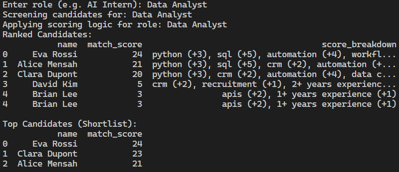

# AI-Powered Recruitment Automation System

## Overview

This project demonstrates how artificial intelligence and data-driven workflows can improve recruitment processes by automating candidate screening, improving data quality, and supporting decision-making.

The system simulates a recruitment pipeline where candidate data is cleaned, analysed, scored and transformed into actionable insights.

## Problem

Recruitment processes often involve:
- Manual CV screening
- Inconsistent candidate evaluation
- Poorly structured data
- Time-consuming administrative tasks

## Solution

This project provides an AI-assisted workflow that:
- Cleans and standardises candidate data
- Scores candidates based on role-specific requirements
- Dynamically adapts scoring logic depending on the role
- Generates explainable insights for each candidate
- Produces a ranked shortlist for decision-making

## Features

- Data cleaning and preprocessing
- Role-adaptive candidate scoring
- Explainable scoring system (score breakdown)
- Automated shortlist generation
- Candidate summary generation
- CLI-based interaction

## Example Output

## Tech Stack

- Python
- Pandas
- NumPy

## How to Run

pip install -r requirements.txt
python src/main.py

## Future Improvements

- Integration with real CRM systems
- LLM-based CV parsing and summarisation
- Web dashboard (Streamlit)
- Candidate-job matching using embeddings
- Duplicate candidate detection

## Key Insight

This project focuses on practical AI for business operations, prioritising:
- usability
- explainability
- automation
over purely theoretical machine learning models.